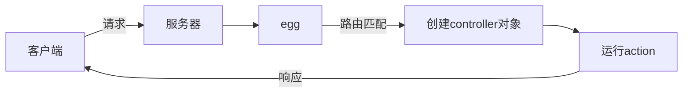
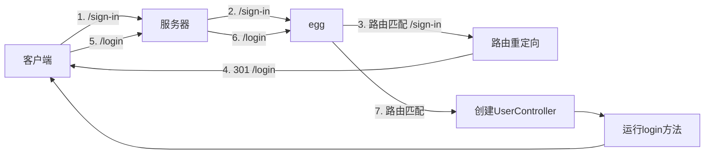
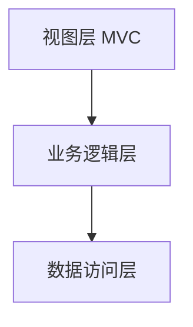
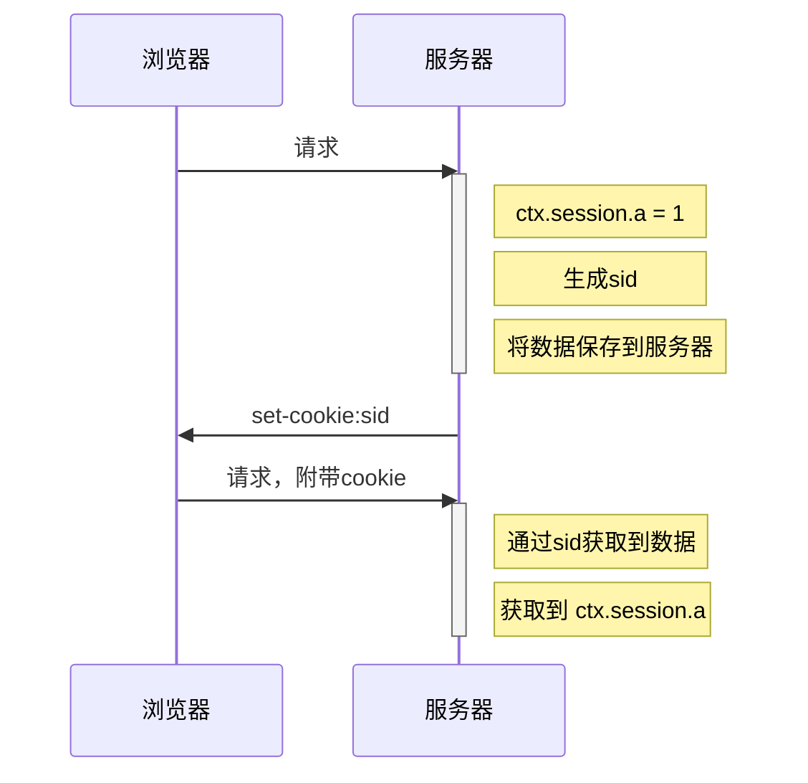
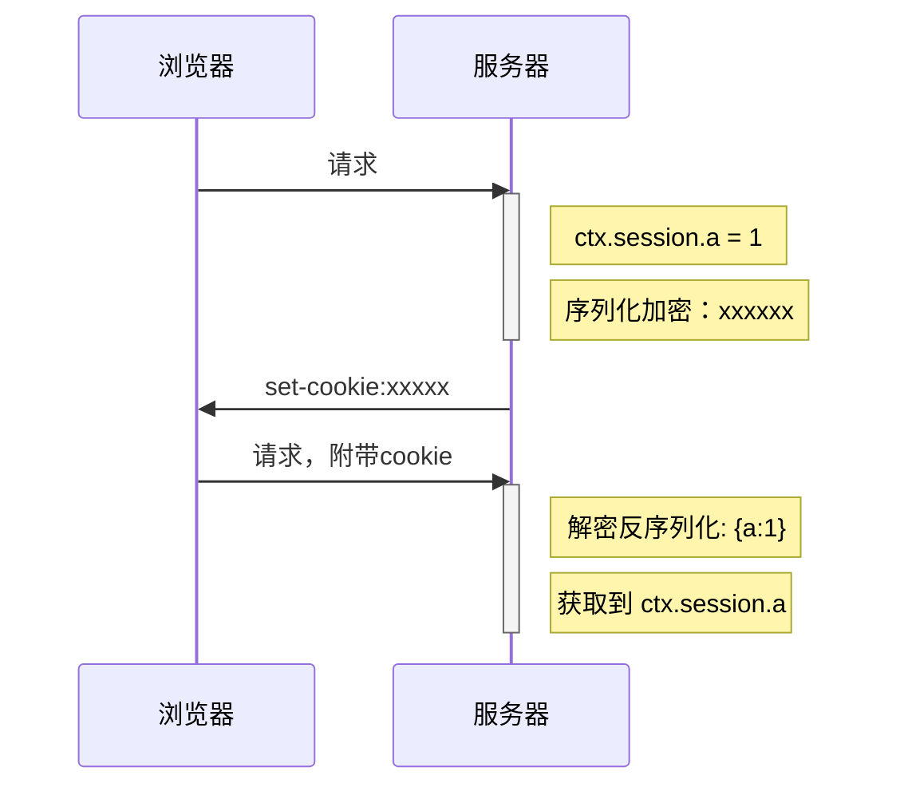
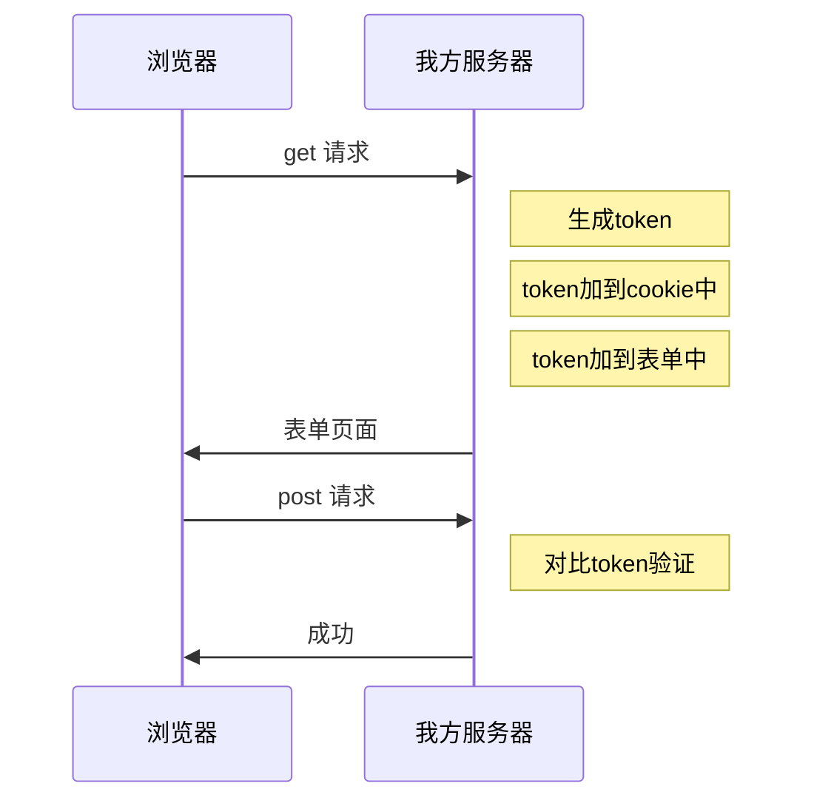
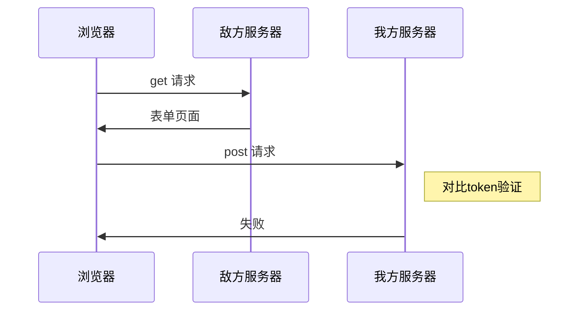
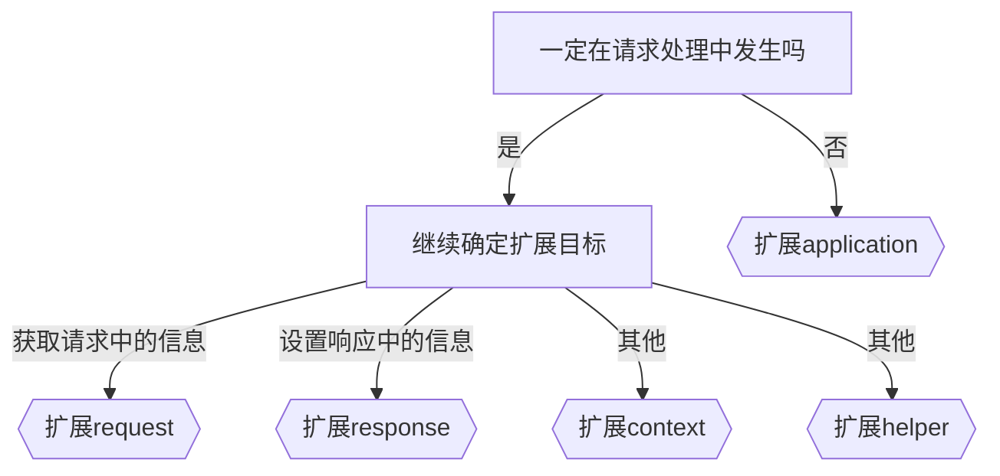

https://eggjs.org/zh-CN/intro/progressive
nppm i egg
pnpm install -D egg-bin


约定规范
app ->服务器的绝大多数应用都在这里面
    controller=>处理对应路由的请求处理
        home.js
        ....
    router.js =>配置请求的路由
    public =>静态资源目录
    middleware=》中间件
    service=>服务层数据
    schedule=》定时任务
config
    config.default.js
        // 用于处理cookie的密钥
        module.exports.keys = "wuli"
    config/plugin.js`中启用插件




# 路由匹配

路由是一个桥梁，它连接了**请求**和**请求处理函数**

## 普通路由设置

```js
// app/router.js
// app对象是全局对象，跨越所有请求，它在egg启动后就会创建
module.exports = app => {
  // app.router：通过 new Router 创建的路由对象
  // app.controller: 根据 app/controller 文件夹中的文件创建的对象
  const { router, controller } = app; 
  router.get('/user/:id', controller.user.info);
  // 或 
  // router.get('/user/:id', "user.info");
};
```

配置路由时，可以给路由取一个合适的名称，该名称在将来可能会有用

```js
router.get("userdetail", "/user/:id", "user.info");
```

## 重定向

```js
router.get("/login", "user.login");
router.redirect("/sign-in", "/login");
```




## 路由映射过多？

`app/router.js`是集中用于映射路由的模块，不建议把它的代码分散的其他地方

可以参考下面的做法：

```js
const mapper = {};
mapper.mapUser = function (app){
  const {router} = app;
  const prefix = "/api/user";
  router.post(`${prefix}/login`, "user.login");
  router.post(`${prefix}/reg`, "user.reg");
  router.get(`${prefix}/:id`, "user.info");
  // ...
}

mapper.mapNews = function (app){
  const {router} = app;
  const prefix = "/api/news";
  router.get(`${prefix}/`, "news.all");
  router.get(`${prefix}/:id`, "news.one");
  // ...
}

module.exports = app => {
  Object.values(mapper).forEach(m=>m(app));
}
```

## 控制器在子目录？

假设控制器在`app/controller/user/auth`

```js
router.get("/user/login", "user.auth.login")
router.get("/user/login", controller.user.auth.login)
```

## RESTful 风格的 URL 定义

`router`提供了`resources`函数，用于定义`RESTful`风格的`api接口`

```js
// blogs: RESTful风格对应的资源名称
// /api/blog: 基础路径
// controller
router.resources('blogs', '/b', controller.blog);
```

上面一句代码的结果类似于：

```js
router.get("blogs", "/b", controller.blog.index); // 获取所有博客 或 分页获取博客
router.get("new_blog", "/b/new", controller.blog.new); // 获取添加博客的表单页面
router.get("blog", "/b/:id", controller.blog.show); // 获取某一篇博客
router.get("edit_blog", "/b/:id/edit", controller.blog.edit); // 获取某一篇博客的编辑界面
router.post("blogs", "/b", controller.blog.create); // 添加一篇博客
router.put("blog", "/b/:id", controller.blog.update); // 修改一篇博客
router.delete("blog", "/b/:id", controller.blog.destroy); // 删除一篇博客
```

如果我们不需要其中的某几个方法，可以不用在 `blog.js` 里面实现，这样对应 URL 路径也不会注册到 Router。


# Controller 和 action

网站中有很多的资源，比如`用户`、`文章`、`评论`

大部分情况下，对某个资源的处理，就对应一个`Controller`

在`egg`中，对`Controller`的要求如下：

- 必须写到`app/controller`文件夹中
- 基类继承自`Controller`的类（非必须，但建议这么做）
- 文件名就是`Controller`的名称

当匹配到某个`Controller`，同时匹配到某个`action`时，`egg`会：

1. 创建`Controller`实例
2. 调用对应的`action`方法


## ctx的获取

`Koa`的`context`对象可以通过以下两种途径获取：

- `action`的参数
- `this.ctx`，`controller`实例中包含`context`对象


## 下一个中间件？

在`MVC`的结构中，`controller`不应该关心其他中间件的执行

因此，在整个洋葱模型中，`controller`应该处于洋葱的最里层

所以，`egg`没有把`next`函数给予`controller`


# 静态资源

默认情况下，`app/public`目录为静态资源目录，请求路径`/public/*`中`*`位置对应的请求将被映射到`app/public`目录

`egg`之所以能够映射静态资源，并非它本身具有这样的能力，而是它在内部使用了插件`egg-static`

> https://github.com/eggjs/egg-static

# 插件


`egg`本身其实只是搭建了一个框架，拥有一套规范，更多的额外功能都是靠各种插件完成的

## 插件的命名

egg插件的命名规范为`egg-*`

比如，静态资源映射的插件名称为`egg-static`

## 插件的启用

安装好插件后，默认是没有启动该插件的，需要在`config/plugin.js`中启用插件

```js
module.exports = {
  插件名称: {
    enable: 是否启用,
    package: 插件在node_modules中的包名,
    path: 插件的绝对路径，与package配置互斥
  }
}
```

比如，对于`egg-static`插件，可以通过下面的配置启用它

```js
module.exports = {
  static: {
    enable: true,
    package: "egg-static"
  }
}

或

exports.static = {
  enable: true,
  package: "egg-static"
}
```

由于`egg-static`是一个内置插件，大部分内置插件都是自动启用的。同时，内置插件可以通过更加简单的方式进行启用和关闭

```js
exports.static = false;
```

## 插件的配置

`config/plugin.js`只是控制插件的启用和关闭，对于插件的配置需要在`config/config.default.js`中完成

这样做的逻辑理念是：集中配置，集中管理

不同的插件有不同的配置，需要阅读插件的官方文档

```js
exports.static = {
  // egg-static 的配置
}
```


## MVC


## 编写中间件

路由级别的中间件
  const verifyToken = app.middleware.verifyToken({}, app);
  router.get("/", verifyToken, "home.index")


全局中间件
按照egg统一配置的原则，需要在config/config.default.js中配置中间件
exports.middleware = ["mymid"]
exports.mymid = {
  match: "/login", //匹配
  a: 1
}

内置中间件
egg提供了一些内置的中间件，可通过app.config.coreMiddlewares查看

## 提取通用模型
全局通用模型放到app.locals，通常在app.js中设置

上下文通用模型放到ctx.locals中，通常在中间件中设置

局部模型一般在具体的action中设置

# 三层架构 + MVC



理论梳理：

**在服务端使用`MVC`模式，是为了降低服务端渲染的复杂度**

**在服务端使用三层架构，是为了降低整个系统的复杂度**


# 在egg中处理业务逻辑

egg提供了一套标准化的流程，用于搭建业务逻辑层

## 创建service

```js
// app/service/local.js
const Service = require('egg').Service;

class LocalService extends Service {
  async getProvinces() {
    const resp = await this.app.axios.get(`${this.config.$apiBase}/api/local`);
    return resp.data;
  }
}

module.exports = LocalService;
```

- service模块必须放到`app/service`目录中
- service模块必须导出一个继承自`Service`的类
- egg会在**每次请求**到达后创建该类的实例
- 父类`Service`中包含了下面的属性：
  - `this.ctx`
  - `this.app`
  - `this.config`

## 使用service

每次请求到达后，egg会实例化所有的Service，并保存到`context.service`中

举个栗子

```
|-app
	|-service
		|-sub
			|-t1.js
	 - t2.js
	 - t3.js
```

上面的目录结构定义了3个service，因此，你可以在`ctx`中通过下面的方式获取它们的实例

```js
ctx.service.sub.t1
ctx.service.t2
ctx.service.t3
```

具体的实例

```js
// app/controller/home.js
const Controller = require("egg").Controller;

module.exports = class extends Controller {
  async index() {
    const provinces = await this.ctx.service.local.getProvinces();
    var model = {
      title: "首页",
      provinces
    };
    await this.ctx.render("home", model);
  }
};
```

> 不仅仅在controller中可以使用service，在service中也可以通过 `thix.ctx.service` 获取其他的service

为了让使用更加方便，egg定义了别名，在controller和service中均可以使用下面的方式更加简单的获取

```js
this.service
```


# 三层架构 + MVC


# 在egg中使用数据库

egg支持多种方式操作数据库：

- mysql：https://eggjs.org/zh-cn/tutorials/mysql.html
- sequelize：https://eggjs.org/zh-cn/tutorials/sequelize.html
- mongoose：https://github.com/eggjs/egg-mongoose
- redis：https://github.com/eggjs/egg-redis


# 环境配置
## 两种设置方式

框架有两种方式指定运行环境：

1. 通过 `config/env` 文件指定

   ```
   // config/env
   prod
   ```

2. 【推荐】通过 `EGG_SERVER_ENV` 环境变量指定运行环境更加方便，比如在生产环境启动应用：

   ```
   EGG_SERVER_ENV=prod egg-bin dev
   ```


# 获取运行环境

框架提供了变量 `app.config.env` 来表示应用当前的运行环境。

若没有指定`config/env`文件，同时也没有指定`EGG_SERVER_ENV`环境变量，`app.config.env`的值由`NODE_ENV`确定

确定的方式如下：

| NODE_ENV   | EGG_SERVER_ENV | 说明         |
| ---------- | -------------- | ------------ |
| 其他       | local          | 本地开发环境 |
| test       | unittest       | 单元测试     |
| production | prod           | 生产环境     |

# 针对环境的配置

egg支持下面这些配置

```
config
|- config.default.js
|- config.prod.js
|- config.unittest.js
|- config.local.js
```

`config.default.js` 为默认的配置文件，所有环境都会加载这个配置文件，一般也会作为开发环境的默认配置文件。

当指定 env 时会同时加载对应的配置文件，并覆盖默认配置文件的同名配置。如 `prod` 环境会加载 `config.prod.js` 和 `config.default.js` 文件，`config.prod.js` 会覆盖 `config.default.js` 的同名配置

例如：

```js
// config/config.default.js
exports.cluster = {
  listen: {
    port: 7001,
  },
};

// config/config.prod.js
exports.cluster = {
  listen: {
    port: 5000,
  },
};

```

当为`local`环境时，会使用默认配置7001端口，而当为`prod`环境时，会使用`prod`配置的5000端口


有的时候，可能需要自定义环境，比如开发阶段，不同的开发者可能使用的开发环境有差异，尽管这很少见。

如果是这种情况，可以设置`EGG_SERVER_ENV`为一个自定义的值，然后配置相应值的`config`文件即可

```js
// package.json
{
	"scripts":{
		"dev": "EGG_SERVER_ENV=yuanjin egg-bin dev"
	}
}

// config/config.yuanjin.js
exports.cluster = {
  listen: {
    port: 6000,
  },
};
```


# egg-cluster

egg内置了一个插件`egg-cluster`，它的作用是在egg启动时，启动多个子进程

因此，egg实际上是运行在多个进程上的应用，这些进程的职责分别为：

- **主进程**，Master 进程：稳定性极高的进程，主要负责管理其他进程。因此，对于egg应用，无须使用`pm2`等工具。
- **worker进程**：由主进程开启，通常情况下数量和cpu的核数保持一致。worker进程是真正用于处理请求的进程。某次请求具体交给哪个worker进程来处理由主进程调度
- **Agent进程**：由主进程在启动后开启，只有一个，相当于其他进程的秘书，通常用于做各种脏活累活，比如维持一个长连接。agent进程通常对开发者是隐形的，我们平时并不会接触它。


# 部署
## egg-scripts

`egg-scripts`能够提供一些命令，来启动和停止线上环境

1. 安装

   ```
   npm i egg-scripts
   ```

2. 配置脚本

   ```json
   {
     "scripts": {
       "start": "egg-scripts start --daemon",
       "stop": "egg-scripts stop"
     }
   }
   ```

3. 运行

   ```shell
   npm start # 启动
   npm run stop # 停止
   ```

   

启动命令中支持以下参数：

- `--title=name`，设置应用全名，默认为`egg-server-${APP_NAME}`

  - 在停止时，建议指定停止的egg应用名称，否则，如果服务器运行了多个egg应用，将会停止所有的egg应用

    ```
    egg-scripts stop --title=myegg-server
    ```

- `--port=7001` 端口号，默认会读取环境变量 `process.env.PORT`，如未传递将使用框架内置端口 `7001`。
- `--daemon` 是否允许以守护进程的模式运行。
- `--env=prod` 框架运行环境，默认会读取环境变量 `process.env.EGG_SERVER_ENV`， 如未传递将使用框架内置环境 `prod`。
- `--workers=2` 框架 worker 线程数，默认会创建和 CPU 核数相当的 app worker 数，可以充分的利用 CPU 资源。
- `--https.key` 指定 HTTPS 所需密钥文件的完整路径。
- `--https.cert` 指定 HTTPS 所需证书文件的完整路径。

# 编写定时任务

有的时候，我们可能会希望定期做一些事情，比如：

- 定期更新缓存
- 定期删除一些不再使用的文件
- 定期检查数据库，删除无意义的数据
- 定期爬取一些数据，保存到数据库
- 等等

尽管我们完全可以通过`setInterval`来处理该问题，但在`egg`中，可以非常简单的完成该操作，你只需要在`app/schedule`文件夹中编写各种任务即可

`egg`启动后，会读取该文件夹中的所有模块，把它们的导出当做任务定期执行

## 方式1

```js
// app/schedule/cacheLocals
const Subscription = require("egg").Subscription;

module.exports = class extends Subscription {
  // 通过 schedule 属性来设置定时任务的执行间隔等配置
  static get schedule() {
    return {
      interval: "1m", // 1 分钟间隔
      type: "all", // 指定所有的 worker 都需要执行
    };
  }

  // subscribe 是真正定时任务执行时被运行的函数
  async subscribe() {
    console.log("更新缓存");
    const key = "province";
    const resp = await this.app.axios.get(`${this.config.$apiBase}/api/local`);
    //缓存
    this.app.redis.set(key, JSON.stringify(resp.data));
  }
};
```

## 方式2

```js
module.exports = {
  schedule: {
    interval: '1m', // 1 分钟间隔
    type: 'all', // 指定所有的 worker 都需要执行
  },
  async task(ctx) { // task 是真正定时任务执行时被运行的函数
    console.log("更新缓存");
    const key = "province";
    const resp = await ctx.app.axios.get(`${ctx.app.config.$apiBase}/api/local`);
    //缓存
    ctx.app.redis.set(key, JSON.stringify(resp.data));
  },
}
```

## schedule配置

无论使用哪一种方式，都必须提供`schedule`属性来配置任务

- `interval`：字符串，描述任务执行的间隔时间。参考：https://github.com/vercel/ms

- `cron`：字符串，任务执行的契机，它和`interval`设置一个即可。

  参考：https://github.com/harrisiirak/cron-parser

  在线生成器：https://cron.qqe2.com/

  ```js
  "* */3 * * * * "  // 每隔3分钟执行一次
  "0 0 0 * * 3" // 每周3的凌晨执行一次
  "0 0 0 24 12 *" // 每年圣诞节执行一次
  ```

- `type`，任务类型，支持两种配置：

  - `worker`，只有一个 worker 会执行这个定时任务，每次执行定时任务的 worker 的选择是随机的
  - `all`，每个 worker 都会执行这个定时任务。

- `immediate`，如果设置为`true`，应用启动时会立即执行该任务

- `env`，数组，只有在指定的环境中才会启动该任务

- `disable`，一个开关，表示任务是否被禁用


> 更多关于任务的操作参考：https://eggjs.org/zh-cn/basics/schedule.html


> egg在内部使用`egg-logger`插件完成日志记录

# 日志
## 日志路径

默认情况下，日志保存在`根目录/logs/工程名`中

可以通过下面的配置自定义日志路径

```js
exports.logger = {
  dir: '/var/logs/egg-logs',
};
```

> 建议根据环境的不同配置不同的日志路径
>
> 开发环境可以保持不变
>
> 生产环境放到系统统一的日志目录中

## 日志分类

egg的内置日志分为下面几类，通过相关api即可完成日志记录

|    类别    |    输出目标    |        含义         |                api                 |
| :--------- | :------------- | :------------------ | :--------------------------------- |
| **appLogger** | **项目名-web.log** | **应用相关日志** |   **ctx.logger<br />app.logger**   |
| coreLogger |  egg-web.log   | 框架内核、插件日志  | ctx.coreLogger<br>app.coreLogger |
| errorLogger | common-error.log | error级别的日志均会记录到这里 | 详见日志级别 |
| agentLogger | egg-agent.log | agent的进程日志 | agent.logger |

无论使用哪个`api`记录日志，都会有对应的**日志级别**，分别是

```js
日志对象.debug("some info"); // 记录调试信息
日志对象.info("some info"); // 记录普通信息
日志对象.warn("some info"); // 记录警告信息
日志对象.error(new Error("some info")); // 记录错误信息，应该使用错误对象，否则无法得到堆栈信息
 
```

## 日志配置

```js
// 配置文件
exports.logger = {
  // 配置日志文件的目录
  dir: '/var/logs/egg-logs',
  // 配置不同类别的日志对应的文件名
  appLogName: 'duyi-app-web.log',
  coreLogName: 'egg-web.log',
  agentLogName: 'egg-agent.log',
  errorLogName: 'common-error.log',
  // 配置哪些级别及其以上的日志要被记录到日志文件，设置为NONE则会关闭日志记录，默认为 INFO
  level: 'DEBUG', 
  // 配置哪些级别及其以上的日志要被打印到控制台，设置为NONE则会关闭日志记录，默认为 INFO
  consoleLevel: 'DEBUG'
  // 配置日志文件的编码，默认为 utf-8
  encoding: 'gbk',
  // 是否使用json格式记录日志，默认为false
  outputJSON: true,
};
```

## 自定义日志

使用自定义日志可以增加日志的类别

```js
// 配置文件
// 配置自定义日志类别
exports.customLogger = {
    myLogger: { // 属性名为类别名称
      file: path.resolve(__dirname, "../logs/my-logger.log"), // 配置日志文件
      // 配置哪些级别及其以上的日志要被记录到日志文件，设置为NONE则会关闭日志记录，默认为 INFO
      level: 'DEBUG', 
      // 配置哪些级别及其以上的日志要被打印到控制台，设置为NONE则会关闭日志记录，默认为 INFO
      consoleLevel: 'DEBUG',
      // 配置日志文件的编码，默认为 utf-8
      encoding: 'gbk',
      // 是否使用json格式记录日志，默认为false
      outputJSON: true,
      // app logger
      formatter(meta) {
          return `[${meta.date}] ${meta.message}`;
      },
      // ctx logger
      contextFormatter(meta) {
      	return `[${meta.date}] [${meta.ctx.method} ${meta.ctx.url}] ${meta.message}`;
      },
    }
}
```

记录自定义日志：

```js
app.getLogger('myLogger') // 获取全局应用日志对象
ctx.getLogger('myLogger') // 获取上下文日志对象
```

> schedule的日志就是一个自定义日志，日志类别名为`scheduleLogger`

> 更多日志的功能参考：https://eggjs.org/zh-cn/core/logger.html


# 使用session
> egg 在内部使用 `egg-session` 插件完成session功能，`egg-session`插件在内部使用`koa-session`完成session功能


```js
ctx.session.prop = value;
```

注意点：

- 设置的属性不能以`_`开头
- 属性名不能为`isNew`
- 具体原因见`koa-session`源码：https://github.com/koajs/session/blob/master/lib/session.js

# 原理

`koa-session`和普通session不同，它在默认情况下，是将session中保存的数据序列化后加密保存到客户端的`cookie`中


传统的`session`处理模式




`egg-session`的处理模式



# 配置

```js
exports.session = {
  key: 'EGG_SESS', // cookie的键
  maxAge: 24 * 3600 * 1000, // cookie的过期时间
  httpOnly: true, // 该cookie是否仅允许http传输，不允许js获取
  encrypt: true, // 该cookie的内容是否要加密
  renew: false, // 是否每次请求后进一步延长cookie的过期时间
};
```


虽然不推荐，不过你可以将这种session模式转换为传统模式，只需要设置session的存储模式即可

```js
// app.js
module.exports = app => {
  // 自定义session存储模式
  app.sessionStore = {
    // 根据指定的键得到对应的session值
    async get (key) {
      // return value;
    },
    // 根据指定的键、值、过期时间（毫秒），设置session
    async set (key, value, maxAge) {
      
    },
    // 摧毁session调用的方法
    async destroy (key) {
      // destroy key
    },
  };
};
```

你也可以直接使用插件`egg-session-redis`，安装后，启用它即可

**注意：一旦选择了将 Session 存入到外部存储中，就意味着系统将强依赖于这个外部存储，当它挂了的时候，我们就完全无法使用 Session 相关的功能了。因此我们更推荐大家只将必要的信息存储在 Session 中，保持 Session 的精简并使用默认的 Cookie 存储，用户级别的缓存不要存储在 Session 中。**


# 使用 koa 的异常处理模式

```js
// app.js
module.exports = (app) => {
  app.on("error", (err, ctx) => { // 和 koa 的异常处理类似
    console.log(err, ctx);
  });
};
```

# 使用 egg 的异常处理模式

为了更方便的处理常见的应用场景，egg内部使用了`egg-onerror`插件来处理异常

默认情况下，`egg-onerror`会对异常做出以下处理

| 请求需求的格式 | 环境             | errorPageUrl 是否配置 | 返回内容                                             |
| -------------- | ---------------- | --------------------- | ---------------------------------------------------- |
| HTML & TEXT    | local & unittest | -                     | onerror 自带的错误页面，展示详细的错误信息           |
| HTML & TEXT    | 其他             | 是                    | 重定向到 errorPageUrl                                |
| HTML & TEXT    | 其他             | 否                    | onerror 自带的没有错误信息的简单错误页（不推荐）     |
| JSON & JSONP   | local & unittest | -                     | JSON 对象或对应的 JSONP 格式响应，带详细的错误信息   |
| JSON & JSONP   | 其他             | -                     | JSON 对象或对应的 JSONP 格式响应，不带详细的错误信息 |

针对该插件，可以做出以下配置：

```js
// config/config.default.js
exports.onerror = { // 配置 egg-onerror 插件
  errorPageUrl: '/error',// 线上页面发生异常时，重定向到这个地址
  all(err, ctx) {
    // 在此处定义针对所有响应类型的错误处理方法
    // 注意，定义了 config.all 之后，其他错误处理方法不会再生效
    ctx.body = 'error';
    ctx.status = 500;
  },
  html(err, ctx) {
    // html hander
    ctx.body = '<h3>error</h3>';
    ctx.status = 500;
  },
  json(err, ctx) {
    // json hander
    ctx.body = { message: 'error' };
    ctx.status = 500;
  }
};
```


## 关于404

框架并不会将服务端返回的 404 状态当做异常来处理

如果开发者对404的状态码没有给予响应体，则egg会自动给予响应体，它的方式是：

- 当请求被框架判定为需要 JSON 格式的响应时，会返回一段 JSON：

  ```json
  { "message": "Not Found" }
  ```

- 当请求被框架判定为需要 HTML 格式的响应时，会返回一段 HTML：

  ```html
  <h1>404 Not Found</h1>
  ```

  

框架支持通过配置，将默认的 HTML 请求的 404 响应重定向到指定的页面。

```js
// config/config.default.js
exports.notfound = {
  pageUrl: '/404',
};
```


# egg的其他功能

- [文件上传](https://eggjs.org/zh-cn/basics/controller.html#获取上传的文件)
- [国际化I18n](https://eggjs.org/zh-cn/core/i18n.html)
- [helper对象](https://eggjs.org/zh-CN/basics/objects#helper)
- [验证](https://eggjs.org/zh-CN/basics/controller#%E5%8F%82%E6%95%B0%E6%A0%A1%E9%AA%8C)

自定义 Helper 方法
在应用开发中，我们可能经常需要自定义一些 Helper 方法。例如上面例子中的 formatUser，我们可以通过 框架扩展 的形式来自定义 Helper 方法。


# 安全

## xss 防护
`egg`内部开启了`egg-security`插件，用于提供一套成熟的安全实践

`egg-security`在`helper`中扩展了一些方法，用于`xss`防护

1. `helper.escape`，该方法会对整个字符串进行XSS过滤，转换目标字符串中的危险字符

   ```js
   const str = '<a href="/">XSS</a><script>alert("abc") </script>';
   console.log(ctx.helper.escape(str));
   // => &lt;a href=&quot;/&quot;&gt;XSS&lt;/a&gt;&lt;script&gt;alert(&quot;abc&quot;) &lt;/script&gt;
   ```

   这对在页面中显示用户字符很有用

2. `helper.sjs`，该方法会将字符串中进行JS Encode，将某些特殊字符，转换为十六进制的编码形式`\x编码`

   ```js
   const foo = '"hello"';
   
   // 未使用 sjs
   console.log(`var foo = "${foo}";`);
   // => var foo = ""hello"";
   
   // 使用 sjs
   console.log(`var foo = "${ctx.helper.sjs(foo)}";`);
   // => var foo = "\\x22hello\\x22";
   ```

   这对在JS中动态加入用户字符很有用

3. `helper.shtml`，过滤一段`html`字符串

   ```js
   const value = `<a t=1 title="a" href="http://www.domain.com">google</a><script>evilcode…</script>`;
   console.log(ctx.helper.shtml(value));
   // => <a title="a">google</a>&lt;script&gt;evilcode…&lt;/script&gt;
   ```

   可见，对于某些标签和属性，是可以保留的，这取决于白名单的设置，而对于白名单之外的标签和属性，不会保留或者进行编码处理

   另外，针对某些元素的链接，可以配置域名白名单

   ```js
   // config/config.default.js
   
   
   exports.helper = {
     shtml: {
       whiteList: { a: ["title", "href"] }, // 配置shtml的白名单
       domainWhiteList: ["www.domain.com"], // 配置shtml的域名白名单
     },
   };
   ```

   注意 shtml 的适用场景，一般是针对来自用户的富文本输入，切忌滥用。 此类场景一般是论坛、评论系统等，即便是论坛等如果不支持 HTML 内容输入，也不要使用此 Helper，直接使用 `escape` 即可。


##  csrf 防护

`egg-security`选择的是使用`csrf token`进行 csrf 防护

原理：



如何防护：



egg提供了`ctx.csrf`来获取可以与`cookie`匹配的token

在下次请求时，仅需将该token放置到`query`或`body`中的`_csrf`字段即可，例如

```ejs
<!-- 放置到 query 中 -->
<form action="?_csrf=<%=ctx.csrf %>" method="POST">
  ...
</form>

<!-- 放置到 body 中 -->
<form action="" method="POST">
  <input type="hidden" name="_csrf" value="<%=ctx.csrf %>">
  ...
</form>
```

对于`ajax`请求，可以直接在js中获取到`cookie`中的`token`，放置到`body`或`query`即可

也可以针对字段名进行配置

```js
// config/config.default.js
exports.security = {
  csrf: {
    cookieName: 'csrfToken', // Cookie 中的字段名，默认为 csrfToken
    bodyName: "_csrf",
    queryName: "_csrf"
  },
};
```

由于`egg-security`制作了中间件，因此，对于security中的配置，可以使用中间件的模式，即是说，下面的配置同样适用：

- match
- ignore
- enable

# 单页应用
mermaid: https://mermaidjs.github.io/#/


工程目录参考
|- app # egg 代码
|- client # vue 代码
|- config # egg 配置
开发阶段
各自运行即可


为了方便启动，可以对egg的package.json稍作改动：

{
  "scripts": {
    "dev": "npm run dev:egg & npm run dev:vue",
    "dev:egg": "egg-bin dev",
    "dev:vue": "cd client && npm run serve",
  }
}
部署阶段
部署后，需要让egg服务器承载对单页应用的访问，因此有两个问题要解决：

如何把vue的打包结果放到egg服务器中

我们可以把vue的打包结果当做是静态资源，放到egg的app/public目录中即可

// client/vue.config.js
const path = require("path");
module.exports = {
  // 选项...
  outputDir: path.resolve(__dirname, "../app/public"),
  devServer: {
    proxy: {
      '/api': {
        target: 'http://127.0.0.1:7001'
      }
    }
  }
};
由于默认情况下，egg对静态资源的访问有前缀/public，为了避免差异，可以去掉该前缀

// config/config.default.js
exports.static = {
  prefix: "/",
};
同时，设置/package.json中的命令：

"scripts": {
  "build": "cd client && npm run build"
},
这样，在根目录中运行npm run build即可打包vue到app/public中

如何实现，访问任何地址都定向到单个页面

这一点其实很简单，仅需配置视图目录和路由即可

// config/config.default.js 
exports.view = { 
  root: [ 
    path.resolve(__dirname, "../app/public"),
    path.resolve(__dirname, "../app/view"),
  ].join(","), // 将 app/public 目录作为模板目录
  // 其他配置
};
// app/router.js
module.exports = (app) => {
  const { router } = app;
  // 针对 api 的配置（略）
	// 若上面无法匹配到api，即匹配到 home.index
  router.all("*", "home.index")
};
// app/controller/home
const Controller = require("egg").Controller;

module.exports = class extends Controller {
  async index() {
    await this.ctx.render("index.html"); // 渲染 index.html 模板
  }
};
# 脚手架
egg 脚手架 `create-egg`: https://www.npmjs.com/package/create-egg
npm init egg

# 框架扩展
- application， `extend/application.js`
- context， `extend/context.js`
- request，`extend/request.js`
- response，`extend/response.js`
- helper，`extend/helper.js`


# 扩展决策树




# 插件文件夹结构

```
插件文件夹
├── package.json
├── app.js (可选)
├── app
│   ├── extend (可选)
│   |   ├── helper.js (可选)
│   |   ├── request.js (可选)
│   |   ├── response.js (可选)
│   |   ├── context.js (可选)
│   |   ├── application.js (可选)
│   ├── service (可选)
│   └── middleware (可选)
├── config
|   ├── config.default.js
│   ├── config.prod.js
|   ├── config.local.js (可选)
└── test
```

插件文件夹可以独立成一个工程，也可以放到主工程的`lib/plugin`中


# 插件的注意事项

值得注意的是：

- 插件没有独立的 router 和 controller

- 插件没有 `plugin.js`

- 插件需要在 `package.json` 中的 `eggPlugin` 节点指定插件特有的信息：

  - `{String} name` - 插件名（必须配置），具有唯一性，配置依赖关系时会指定依赖插件的 name。
  - `{Array} dependencies` - 当前插件强依赖的插件列表（如果依赖的插件没找到，应用启动失败）。
  - `{Array} optionalDependencies` - 当前插件的可选依赖插件列表（如果依赖的插件未开启，只会 warning，不会影响应用启动）。
  - `{Array} env` - 只有在指定运行环境才能开启

  ```json
  {
    "name": "egg-rpc",
    "eggPlugin": {
      "name": "rpc",
      "dependencies": [ "registry" ],
      "optionalDependencies": [ "vip" ],
      "env": [ "local", "test", "unittest", "prod" ]
    }
  }
  ```
# 生命周期
> `egg`提供了许多钩子函数（Hook Function），用于在启动后的不同阶段处理一些事务

这些钩子函数需要配置在`app.js`中：

```js
// app.js
module.exports = class {
  constructor(app) {
    this.app = app;
  }
  //1. 配置文件即将加载，这是最后动态修改配置的时机
  configWillLoad() {
    // 此时 config 文件已经被读取并合并，但是还并未生效
    // 这是应用层修改配置的最后时机
    // 注意：此函数只支持同步调用

    // 例如：服务器每次重启后，使用一个随机的字符串作为cookie加密秘钥，这样可以让之前的cookie强制过期
    this.app.config.keys += Math.random().toString(36).slice(-6);
  }

  //2. 文件加载完成
  async didLoad() {
    // 所有的配置已经加载完毕
    // 该函数可以是异步的

    // 例如：可以把最终的配置保存起来
    save(this.app.config);
  }

  //3. 插件启动完毕
  async willReady() {
    // 所有的插件都已启动完毕，但是应用整体还未开启
    // 此时worker进程还没有开始工作
    // 可以做一些数据初始化等操作，这些操作成功才会启动应用
    // 该函数可以是异步的

    // 例如：根据配置，初始化保存用户上传文件的文件夹
    const dir = this.app.config.$uploadDir;
    if (!isExist(dir)) {
      mkdir(dir);
    }
  }

  //4. worker 准备就绪
  async didReady() {
    // 多个worker进程已开启
  }

  //5. 应用启动完成
  async serverDidReady() {
    // http / https server 已启动，开始接受外部请求
  }

  //6. 应用即将关闭
  async beforeClose() {}
};
```

**注意：在自定义生命周期函数中不建议做太耗时的操作，框架会有启动的超时检测。**

# 第三方登录

> `egg-passport`插件提供了统一的鉴权方案
>
> 它极大的简化了第三方登录的流程
>
> 本节课仅讲解使用，原理部分见课程：「第三方接口」
>
> 官网文档：https://eggjs.org/zh-cn/tutorials/passport.html

# 安装

```shell
npm i egg-passport
npm i egg-passport-github
```

# 配置

```js
// config/plugin.js
exports.passport = {
  enable: true,
  package: 'egg-passport',
};

exports.passportGithub = {
  enable: true,
  package: 'egg-passport-github',
};
```

```js
// config/config.default.js
exports.passportGithub = {
  key: 'your_clientID', // 见第三步
  secret: 'your_clientSecret', // 见第三步
  callbackURL: '/passport/github/callback', // 这是默认值，会影响第三步
};
```

```js
// app/router.js
module.exports = app => {
  const { router, controller } = app;

  // 挂载鉴权路由
  app.passport.mount('github');

  // 上面的 mount 是语法糖，等价于
  // const github = app.passport.authenticate('github', {});
  // router.get('/passport/github', github);
  // router.get('/passport/github/callback', github);
}
```


# 创建应用

新建`github`应用：https://github.com/settings/applications/new

查看`github`应用：https://github.com/settings/applications

创建应用时，`Authorization callback URL`一项，必须和第二步中的配置一致

```
http://127.0.0.1:7001/passport/github/callback
```

创建应用后，会得到`Client ID`和`Client Secret`，把它们填入第二步的配置中

# API

用户的授权地址默认为：`/passport/<strategy>`，比如`/passport/github`

无论你是使用哪一种第三方接口，最终的API都是统一的

- `ctx.user` - 获取当前已登录的用户信息
- `ctx.isAuthenticated()` - 检查该请求是否已授权
- `ctx.logout()` - 退出，将用户信息从 session 中清除

> 更多的api见：https://eggjs.org/zh-cn/tutorials/passport.html#api


